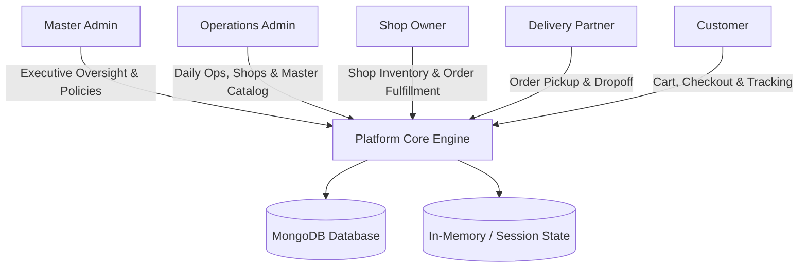
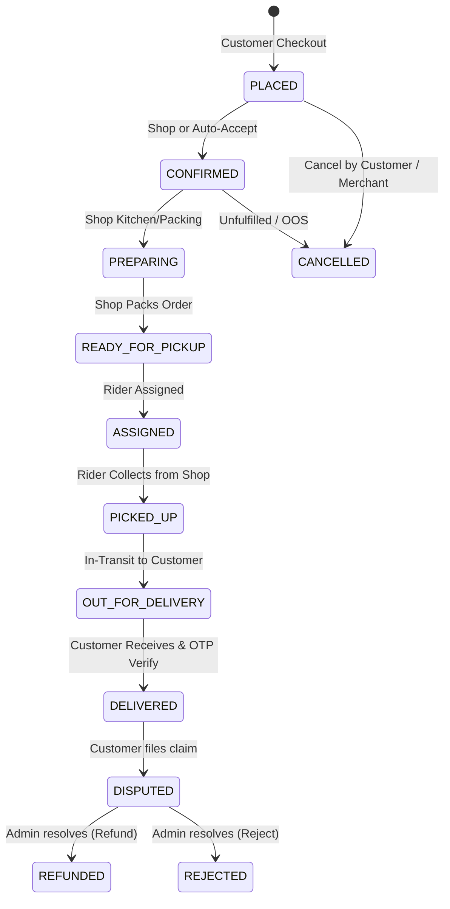

# Hyperlocal Multi-Vendor Marketplace — Core System Logic & Specifications (`main.md`)

> **Document Status**: Single Source of Truth (SSOT)  
> **Target Audience**: Developers, Architects, Product Managers, QA Engineers  
> **Last Updated**: 2026-09-27  
> **Companion Files**: [`frontend.md`](./frontend.md) | [`backend.md`](./backend.md) | [`FEATURES.md`](./FEATURES.md)

---

## 📌 1. Project Overview & Vision

### 1.1 What is this Project?
This project is a high-performance **Hyperlocal Multi-Vendor Marketplace Platform** engineered to connect local brick-and-mortar merchants (restaurants, groceries, bakeries, FMCG stores, farm produce) with nearby customers through on-demand delivery partners (riders).

The platform features strict separation of administrative authority:
1. **Master Admin (Executive Controller)**: Focuses on governance, business intelligence, financial auditing, system feature flags, global policies, appearance/branding, and administrator account provisioning.
2. **Operations Admin (Dispatch, Merchant & Catalog Controller)**: Focuses on daily operational triage, shop onboarding, credential generation, comprehensive 5-tier catalog taxonomy management (Units, Categories, Subcategories, Brands, Master Products & Variants), shop product inventory mappings, dispatch oversight, and customer dispute resolution.
3. **Shop Owner (Merchant Portal)**: Manages store profile, inventory, menu items, stock status, and incoming customer orders.
4. **Delivery Partner (Rider Mobile/Web)**: Manages duty availability (online/offline), accepts delivery orders, navigates routes, and tracks earnings.
5. **Customer (Consumer Shopping Portal)**: Discovers nearby shops, browses catalog, adds to cart, places orders, tracks live status, and files disputes/reviews.

---

## 🏛️ 2. Architectural Philosophy & Separation of Concerns

The platform is designed around strict **Role-Based Access Control (RBAC)** and a decoupled frontend-backend architecture:



### 2.1 Documentation Maintenance Protocol
Whenever a feature, state transition, or business rule changes:
1. **Step 1 — Update `main.md`**: Define the rule change, state diagram update, or domain logic here first.
2. **Step 2 — Update `backend.md`**: Update schemas, endpoints, controllers, and validation rules.
3. **Step 3 — Update `frontend.md`**: Update routes, components, UI states, and context providers.
4. **Step 4 — Update `FEATURES.md`**: Update feature matrices and user portal flows.

---

## 👥 3. System Roles & Responsibilities Matrix

| Role Key | `isUser` Identifier | Name | Primary Responsibilities | Access Scope |
| :--- | :--- | :--- | :--- | :--- |
| `MASTER_ADMIN` | `master` | Platform Master Admin | Executive telemetry, financial settlement audit, global feature flags, marketplace policies, appearance theme editor, admin account lifecycle. | Global / Unrestricted platform governance |
| `ADMIN` | `admin` | Operations Admin | Onboarding merchants, auto-generating store credentials, managing 5-tier catalog taxonomy (Units, Categories, Subcategories, Brands, Products, Variants), shop product listings, order status overrides, dispute resolution. | Operational dispatch, catalog & merchant tools (`/admin/*`) |
| `SHOP_OWNER` | `shop_owner` | Merchant / Store Owner | Store operating hours, product catalog item management, in-stock/out-of-stock toggles, order preparation and fulfillment. | Store-scoped data only |
| `DELIVERY_PARTNER` | `delivery_boy` | Rider / Courier | Duty status (Online/Offline), KYC documentation submission, order acceptance, pickup confirmation, delivery completion. | Rider-assigned orders & wallet data |
| `CUSTOMER` | `user` | End Consumer | Store discovery, cart building, order placement, order live tracking, cancellation, dispute submission. | Personal account, cart & order history |

---

## ⚙️ 4. Core Business Logic & Domain Rules

### 4.1 Merchant Onboarding & Automated Credential Engine
Operations Admins register shops via a dedicated provisioning workflow:
1. **Input Parameters**: Shop Name, Store Category, Opening Time (e.g. `07:00 AM`), Closing Time (e.g. `10:00 PM`), Contact Phone, Street Address.
2. **Deterministic Credential Generation**:
   - Slug: Derived from Shop Name (lowercase, kebab-cased, e.g. `Fresh Mart` $\rightarrow$ `fresh-mart`).
   - Merchant Email: `<slug>@marketplace.com`.
   - Initial Password: `<PascalCaseName>@2026` (e.g. `FreshMart@2026`).
3. **Database Transactions**:
   - Creates a `User` entity with `role: SHOP_OWNER` and `isUser: 'shop_owner'`.
   - Creates a `Shop` entity linked to the newly created User ID as `owner`.
   - Stores `displayPassword` for 1-click credential copying and merchant hand-off.

### 4.2 Comprehensive 5-Tier Master Catalog & Multi-Vendor Inventory Architecture
To guarantee data consistency, avoid product duplication across shops, and support standardized multi-vendor pricing:

$$\text{Unit} \longrightarrow \text{Category} \longrightarrow \text{Subcategory} \longrightarrow \text{Brand} \longrightarrow \text{Master Product \& Variants} \longrightarrow \text{Shop Product (Listing)}$$

1. **Units (`Unit`)**:
   - Standard measurement units (`kg`, `g`, `litre`, `ml`, `piece`, `pack`, `box`, `dozen`).
   - Controlled centrally with unique lowercase symbols and display order.
2. **Categories (`Category`)**:
   - Root taxonomy level (*Fresh Vegetables, Fresh Chicken, Wild Fish & Seafood, Halal Prime Beef, Daily Grocery*).
   - Has Lucide icons, banner images, and description.
3. **Subcategories (`Subcategory`)**:
   - Child taxonomy linked to a parent Category (e.g., *Leafy greens*, *Curry cuts*, *Whole fish*).
   - Restricts and defines `allowedUnitIds` for products under this subcategory.
4. **Brands (`Brand`)**:
   - FMCG/Producer brands (*Farm Fresh Organics, Poultry Pride, Ocean Catch Seafood, Al-Noor Halal Prime, Royal Heritage, Pure Press Botanicals*).
5. **Master Products & Variants (`Product` & `ProductVariant`)**:
   - **`Product`**: Global catalog master item with title, slug, description, image, category, subcategory, brand, and MRP.
   - **`ProductVariant`**: Defines specific packaging/unit size combinations (e.g., Product: *Organic Honey*, Variant: `500 g`, SKU: `HONEY-500G`).
6. **Shop Products (`ShopProduct`)**:
   - Represents a specific vendor's listing of a master product variant.
   - Holds vendor-specific selling price (`sellingPrice`), real-time stock (`stock`), and availability toggle (`isAvailable`).

### 4.3 Order Lifecycle & State Machine



#### Financial Breakdown Per Order
For an order with subtotal $S$, delivery fee $D$, tax $T$, and platform commission rate $C\%$:
- $\text{Total Paid by Customer} = S + D + T$
- $\text{Platform Commission} = S \times (C / 100)$
- $\text{Shop Payout} = S - \text{Platform Commission}$
- $\text{Rider Earnings} = D$ (plus any dynamic surge incentives)

### 4.4 Order Dispute Resolution Logic
When an order is flagged for a dispute:
- **`REFUND` Action**:
  - Payment status transitions to `REFUNDED`.
  - Order status is updated to `CANCELLED` with dispute log notes.
  - Platform records financial refund event.
- **`REJECT` Action**:
  - Dispute claim is marked as rejected.
  - Order status remains in its terminal state (`DELIVERED`).
  - Rationale is logged to immutable activity log.

### 4.5 Delivery Partner Fleet & KYC Pipeline
- Riders register and upload 3 mandatory KYC documents:
  1. Driving License
  2. Vehicle Registration Certificate (RC)
  3. National ID (Aadhaar / Passport)
- KYC Status Lifecycle: `PENDING_VERIFICATION` $\longrightarrow$ `VERIFIED` or `REJECTED`.
- Only `VERIFIED` riders can toggle duty status to `ONLINE` (`isOnline: true`) and receive dispatch assignments.

### 4.6 Security & Two-Factor Authentication (2FA)
- All Administrator logins (`MASTER_ADMIN` and `ADMIN`) require two-step authentication:
  - **Step 1**: Email and password validation.
  - **Step 2**: 6-digit numeric OTP generation valid for 5 minutes (300 seconds).
  - In development/demo mode, the OTP is printed to the server console and returned via debug payload for verification testing.
- Passwords are encrypted with `bcryptjs` (salt rounds: 10).
- Session tokens are signed using JWT (HMAC-SHA256) with role and ID payload.

### 4.7 Dynamic Feature Flags
The platform supports zero-downtime operational toggling:
- `alternative_procurement`: Enables procurement fallback routing across sister stores.
- `customer_wallet`: Allows customers to maintain wallet balance and receive instant refunds.
- `delivery_tracking`: Provides real-time interactive mapping and ETA status tracking.
- `live_gps`: Broadcasts live geolocation coordinates of riders.
- `campaigns`: Marketing promotional discount engine.
- `shop_owner_portal`: Controls access to dedicated merchant operations portal.
- `realtime_notifications`: Push & in-app status update alerts.

### 4.8 Two-Stage Real-Time Rider Navigation Flow (Kitchen $\rightarrow$ Customer Doorstep)
The rider console implements a high-urgency, progressive 2-stage street navigation lifecycle:
1. **Stage 1: En Route to Kitchen (`DELIVERY_PARTNER_ASSIGNED` / `TO_STORE`)**:
   - The map dynamically highlights the primary route polyline from the rider's current coordinates to the store pickup point in high-contrast orange (`#FF7622`).
   - The camera bounds automatically frame the rider and the restaurant.
   - The top navigation button links directly to Google Maps targeting the restaurant address or GPS coordinates.
   - The destination card displays **`📍 1. ACTIVE TARGET: GO TO RESTAURANT`**, with the customer card locked as **`⏳ 2. NEXT: CUSTOMER DOORSTEP`**.
2. **Stage Transition Action ("I Have Reached Restaurant")**:
   - A prominent action button **`📍 I Have Reached Restaurant (Show Customer Directions)`** is displayed.
   - Triggering this button calls `PATCH /api/delivery-boy/orders/:id/status` with `status: 'PICKED_UP'`.
3. **Stage 2: En Route to Customer Doorstep (`PICKED_UP` & `OUT_FOR_DELIVERY` / `TO_CUSTOMER`)**:
   - The map immediately transitions its primary polyline to emerald (`#10b981`), tracing the route from the restaurant/rider directly to the customer doorstep.
   - The camera bounds automatically re-fit to frame the delivery leg.
   - The Google Maps navigation action updates to the customer's doorstep destination.
   - Next step button activates: **`🛵 Start Transit to Customer Doorstep (Out for Delivery)`**, advancing the order to `OUT_FOR_DELIVERY` and prompting the rider to collect the customer's 4-digit doorstep security OTP.

### 4.9 Broadcast Alarm Period & Haversine Distance Telemetry
When new unassigned orders are broadcast to available riders:
1. **Continuous High-Urgency Synthesized Alarm**:
   - Audio synthesized via Web Audio API sounds continuously until the rider explicitly **Accepts** or **Rejects** the ticket.
   - Silenced immediately across all connected tabs upon acceptance or rejection via Socket.io `order:claimed`.
2. **Exact Tri-Point Distance Metrics**:
   - Each unassigned order ticket calculates and renders exact Haversine distance telemetry:
     - **To Kitchen**: Geographic distance ($\text{km}$) from rider device GPS to the restaurant.
     - **To Customer**: Geographic distance ($\text{km}$) from the restaurant to the customer doorstep.
     - **Total Trip**: Summed total journey distance ($\text{km}$).

### 4.10 Merchant Geographic Location Capture (GPS & Nominatim Reverse Geocoding)
When an administrator provisions a shop in the marketplace:
1. **1-Click GPS Acquisition**:
   - Features a **"Use Current Location"** button utilizing HTML5 `navigator.geolocation.getCurrentPosition`.
   - Reverse-geocodes coordinates using free OpenStreetMap Nominatim API, automatically populating Street, City, State, and Pincode.
2. **Database Persistence**:
   - Exact latitude and longitude are saved directly into the MongoDB `Shop` document (`address.lat`, `address.lng`), ensuring rider dispatch and customer tracking maps resolve street-accurate coordinates rather than generic city fallbacks.

### 4.11 Initial Permissions Onboarding Engine (Location, Push Notifications & Audio Autoplay)
To eliminate browser permission friction and ensure real-time location and audio capabilities:
1. **Mandatory Onboarding Prompt at Signup / First Login**:
   - Automatically triggered upon account registration / OTP verification or when an authenticated session detects unconfigured permissions (`!localStorage.getItem('app_permissions_configured')`).
2. **Three Core Permission Pillars**:
   - **📍 Precise GPS Location**: Prompts for native geolocation permission, detects user coordinates, reverse-geocodes street address, and dispatches `'app_location_updated'` to header bars.
   - **🔔 Instant Push Notifications**: Requests native browser push notification permission (`Notification.requestPermission()`) for real-time cooking and delivery updates.
   - **🔊 Audio & Order Alarms**: Pre-unlocks Web Audio API (`AudioContext`) during user click gestures, ensuring delivery boy sirens and customer arrival chimes play uninhibited by browser autoplay mute policies.
3. **1-Click "Enable All Permissions"**:
   - Sequentially requests all three capabilities in a unified, elegant modal with real-time feedback badges.

---

## 📊 5. Core Data Entities Summary

```
User ───────────────┬─── Shop ─── ShopProduct ─── ProductVariant ─── Product
                    ├─── DeliveryPartner                               │
                    ├─── Cart ─── CartItem ────────────────────────────┤
                    └─── Customer ─── Order ─── ActivityLog            ├── Category ── Subcategory
                                                                       ├── Brand
                                                                       └── Unit
```

- **`User`**: Authentication credentials, roles (`MASTER_ADMIN`, `ADMIN`, `SHOP_OWNER`, `DELIVERY_PARTNER`, `CUSTOMER`), `isUser` flag, permissions, OTP secrets.
- **`Shop`**: Merchant business details, coordinates, operating hours, operational flags.
- **`Unit`**: Standard measurement units (`kg`, `g`, `litre`, `ml`, `piece`, `pack`, `box`, `dozen`).
- **`Category`**: Root level catalog taxonomy with custom icons.
- **`Subcategory`**: Child category with allowed units.
- **`Brand`**: Brand entity linked to products and categories.
- **`Product`**: Master catalog product specification with MRP and media.
- **`ProductVariant`**: Master unit/quantity SKU variant under a Product.
- **`ShopProduct`**: Vendor-specific inventory listing with selling price, stock, and availability.
- **`Cart`**: Persistent user cart with automatic subtotal, delivery fee calculation, and discount thresholds.
- **`Order`**: Line items, pricing formulas, rider assignment, lifecycle statuses.
- **`DeliveryPartner`**: KYC documents, duty switch, active delivery reference, earnings.
- **`Customer`**: Address book, total platform spend, lifetime order metrics.
- **`ActivityLog`**: Immutable audit logs capturing Actor, IP, Action, and Target Resource.
- **`FeatureFlag`**: Boolean switches for marketplace subsystems.
- **`AppearanceSetting`**: Theme colors, platform title, dark/light presets.
- **`MarketplaceSetting`**: Delivery radius, platform commission rate, minimum order values.
- **`Notification`**: System announcements broadcasted to specific user roles.
